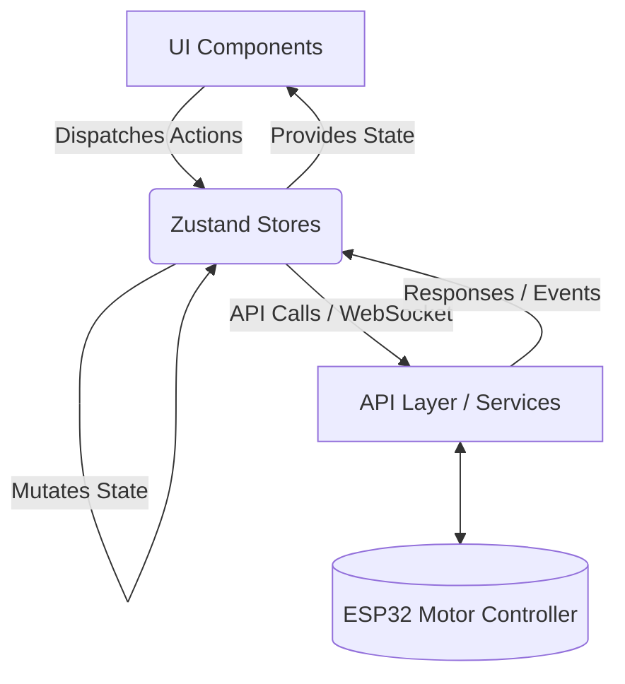

# MotorIQ Architecture

## Application Architecture
MotorIQ utilizes a highly decoupled, modular Frontend architecture designed for real-time industrial telemetry. It follows a unidirectional data flow, separating presentation from state and side effects.



## Layer Architecture
1. **Presentation Layer (`/src/components`)**: Pure UI components, unaware of business logic.
2. **Layout Layer (`/src/layouts`)**: Structural wrappers (AppShell, Sidebar) managing responsive grids.
3. **State Layer (`/src/store`)**: Zustand stores handling business logic, user sessions, and real-time telemetry state.
4. **Service Layer (`/src/services` - Future)**: REST API clients, WebSocket managers, and data formatting.
5. **Routing Layer (`/src/app/router.tsx`)**: React Router managing views and role-based access.

## Folder Relationships
```text
src/
├── app/          # App initialization, routing, global providers
├── components/   # Reusable UI elements (Design System)
│   ├── ui/       # Generic primitives (Buttons, Cards, Inputs)
│   └── domain/   # MotorIQ specific (MotorWidget, TelemetryChart)
├── layouts/      # Structural components (Sidebar, Topbar)
├── pages/        # Routable views (Overview, Analytics, Settings)
├── store/        # Zustand state management
├── lib/          # Utilities (cn, formatters, constants)
└── services/     # API and WebSocket communication
```

## Feature Architecture
Features are built by composing generic `ui` primitives into `domain` components, which are then assembled into `pages`. State is injected at the highest necessary level to avoid prop drilling, utilizing Zustand selectors for performance.

## State Management Strategy
- **Zustand**: Chosen for its minimal boilerplate and excellent React integration.
- **Store Splitting**: State is divided into logical domains (`useUiStore`, `useMotorStore`, `useSettingsStore`) to prevent massive, monolithic state objects and optimize re-renders.

## API Layer
- **Abstraction**: Components never call `fetch` or `axios` directly. All network requests are routed through dedicated service classes or custom hooks.
- **Typing**: All API responses and payloads are strictly typed with TypeScript interfaces.

## Future REST Architecture
- Used for configuration, settings, historical data retrieval, and user authentication.
- Standardized error handling and retry mechanisms via an Axios interceptor or standardized Fetch wrapper.

## Future WebSocket Architecture
- Used exclusively for high-frequency real-time telemetry (RPM, Voltage, Current, Temperature).
- Must include automatic reconnection logic, heartbeat ping/pong, and visual connection status indicators (Online/Offline/Reconnecting).

## ESP32 Communication Layer
- The interface boundary between the web app and the ESP32.
- Data payloads must be kept minimal (JSON) to accommodate the memory and processing limits of the ESP32.

## Dependency Rules
- **Downward Dependency**: Pages depend on Domains, Domains depend on UI, UI depends on nothing.
- **State Isolation**: UI components (`src/components/ui`) must never import from `src/store`. They remain pure and rely on props.

## Module Boundaries
Strict enforcement of module boundaries. A domain component (e.g., `LogViewer`) should not directly manipulate the state of another domain (e.g., `MotorController`). They communicate via shared global stores or events.
