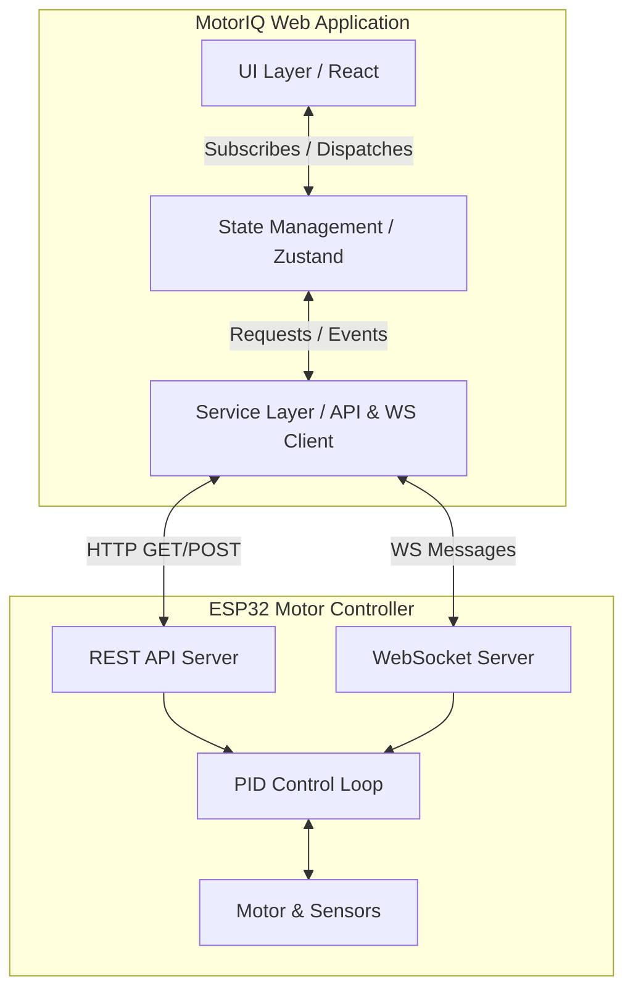
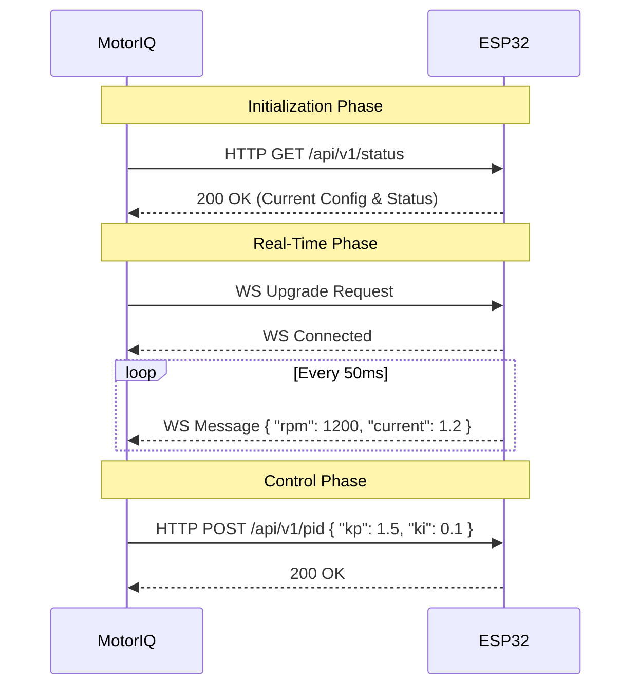

# Architecture

## Overall Architecture

MotorIQ bridges modern web technologies with embedded systems (ESP32). The system follows a decoupled, client-server architecture where the frontend HMI acts as a thin client for displaying data and dispatching commands, while the ESP32 acts as the server maintaining motor state, executing control loops, and broadcasting telemetry.



## Frontend Architecture

The frontend is a Single Page Application (SPA) built with React and TypeScript, strictly adhering to a **Feature-Based Architecture**.

### Feature-Based Architecture

Instead of grouping files by type (e.g., all controllers, all views), files are grouped by business domain. This improves maintainability and scalability.

```text
src/features/telemetry/
├── api/          # API hooks and requests specific to telemetry
├── components/   # UI components specific to telemetry
├── hooks/        # Custom hooks for telemetry logic
├── store/        # State slices for telemetry
├── types/        # TypeScript interfaces for telemetry
└── utils/        # Telemetry-specific helpers
```

**Why this decision?** Industrial systems grow in complexity. Isolating features (Telemetry, PID Control, User Auth, Diagnostics) prevents the codebase from becoming a monolithic tangle of dependencies.

### Application Layers

#### 1. Routing Layer
Managed by `react-router-dom`. It is responsible strictly for mapping URLs to Layouts and Page components. Route guards (e.g., `RequireAuth`, `RequireRole`) are applied at this layer to enforce access control before rendering.

#### 2. Service Layer
Abstracts all external communication. UI components never make direct `fetch` calls. They invoke functions from the Service Layer, which handle network resilience, retries, and data formatting. 

#### 3. Role-Based Access Control (RBAC)
MotorIQ implements a role-based access system to segment interfaces and privileges:
- **`OPERATOR`**: Standard access limited to the Overview, basic Controls, and Settings.
- **`ENGINEER`**: Elevated access to deep diagnostic panels, advanced analytics, sensor calibration, and raw event logs.
Access control is managed via `useAuthStore` and enforced visually via dynamic navigation paths in the `Sidebar` and component-level rendering logic.

#### 4. State Management Strategy
Managed by **Zustand**. 
- **Global UI State:** Managed in `useUiStore` (e.g., `isSidebarCollapsed`, `isMobileDrawerOpen`). These states are persisted via `localStorage` when appropriate.
- **Feature State:** Complex feature-specific states (e.g., current PID tuning parameters before saving) reside in feature-specific Zustand slices.
- **Local State:** Component-specific ephemeral UI states (e.g., dropdown open/close) remain in React `useState`.

#### 4. The Data Engine (Mock & Telemetry)
The current implementation utilizes a background Mock Data Engine that strictly separates data generation from the React UI lifecycle.
- **SimulationEngine:** Calculates realistic physics (inertia, voltage dips, thermal modeling). Runs via `setInterval` in a singleton service.
- **FaultEngine:** Observes the state and triggers structural faults (`useLogStore`) if safety limits are exceeded.
- **EventEngine:** Emits structured operational logs (e.g., "Motor Started", "Fault Cleared").
- **TelemetryService:** The facade. Acts as the single subscriber to the engines, and pushes states directly to Zustand. It is designed to be easily swapped with an `Esp32TelemetryService`.

#### 5. Future REST Layer
Used for low-frequency, high-reliability transactions. Examples include:
- Initializing device configuration.
- Authenticating the user.
- Updating PID gain constants ($K_p$, $K_i$, $K_d$).

#### 6. Future WebSocket Layer
Used for high-frequency, real-time telemetry. The WebSocket connection will stream motor RPM, current, and voltage at 10-50Hz. The Service Layer will throttle/debounce this data before committing to the Zustand store to prevent UI render thrashing.

## ESP32 Communication Architecture

The communication protocol utilizes JSON over WebSockets for telemetry and JSON over HTTP for configuration.



## Folder Relationships

- `src/app/` bootstraps the application and imports `src/layouts/` and `src/store/`.
- `src/features/` encapsulate domains and export their public components and hooks via an `index.ts` (barrel file).
- `src/components/` (global) are utilized heavily by `src/features/` but never the other way around.
- `src/services/` act as the data pipeline, updating `src/store/`, which in turn triggers re-renders in `src/features/`.
